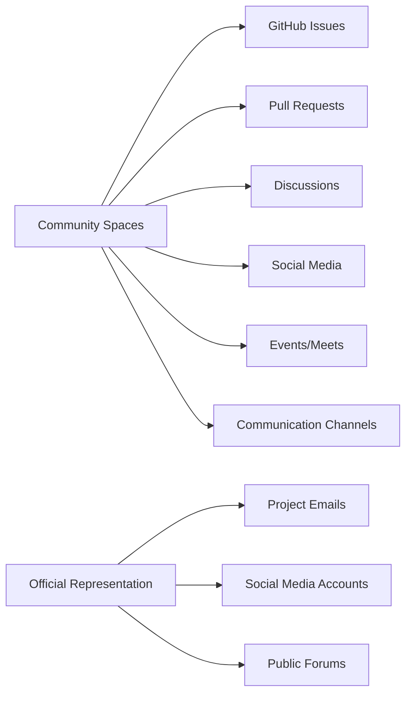
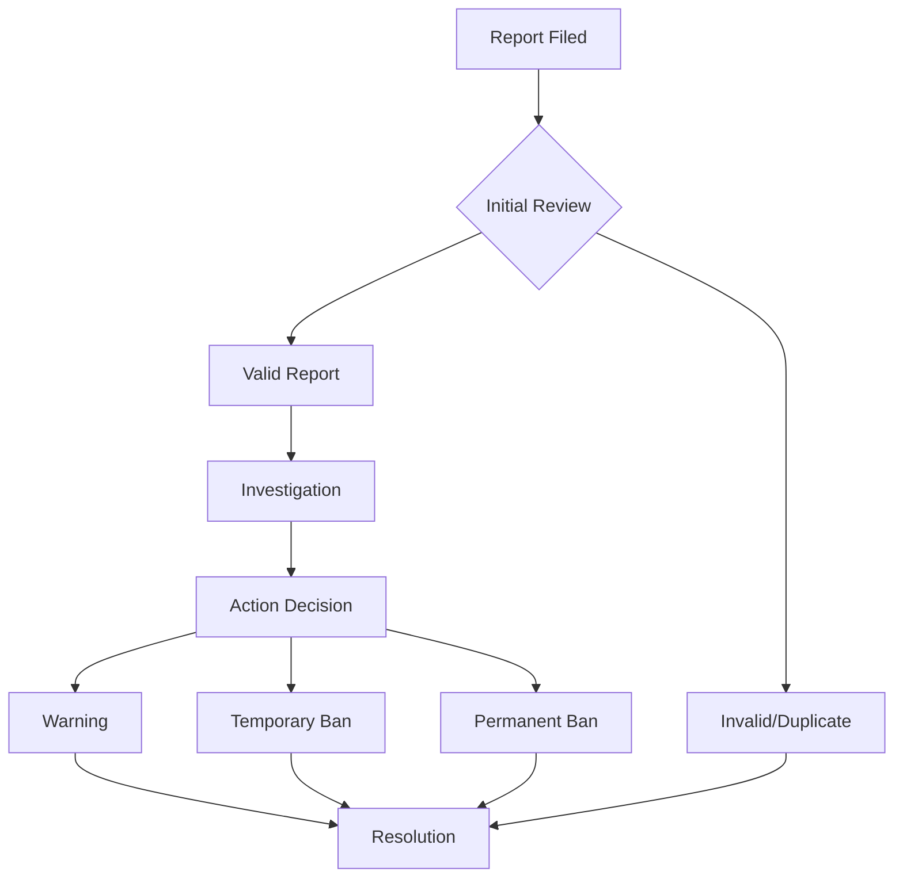

📜 CONTRIBUTOR COVENANT CODE OF CONDUCT

<div align="center">

[](https://git.io/typing-svg)


<br>

```

╔═══════════════════════════════════════════════════════════════════╗
║                                                                   ║
║   🌟 WELCOME TO OUR COMMUNITY - WHERE EVERYONE BELONGS 🌟        ║
║                                                                   ║
╚═══════════════════════════════════════════════════════════════════╝

```

</div>

---

## 🤝 OUR PLEDGE

<div align="center">

<table>
<tr>
<td width="80%" align="center">

### 🕊️ **The Heart of Our Community**

We as members, contributors, and leaders **pledge** to make participation in our  
community a **harassment-free experience** for **everyone**, regardless of:

</td>
<td width="20%" align="center">

</td>
</tr>
</table>

</div>

<div align="center">

| 👤 Personal Characteristics | 🌍 Background | 🧠 Identity |
|:--------------------------:|:-------------:|:-----------:|
| Age | Education Level | Sex Characteristics |
| Body Size | Socio-economic Status | Gender Identity |
| Disability | Nationality | Sexual Orientation |
| Ethnicity | Race | Political Views |
| Experience Level | Religion | Cultural Background |

</div>

> 💫 **EVERYONE** means **EVERYONE** - no exceptions, no excuses, no discrimination.

---

## ⭐ OUR STANDARDS

<div align="center">

### 🌈 **What We Celebrate** ✅

| | Behavior | Impact |
|-|----------|--------|
| 💚 | **Empathy & Kindness** | Builds trust and friendship |
| 💙 | **Respectful Discussions** | Encourages diverse perspectives |
| 💜 | **Graceful Feedback** | Fosters growth and learning |
| 💛 | **Taking Responsibility** | Creates accountability |
| 🧡 | **Community First** | Strengthens our bond |

</div>

<details>
<summary><b>🌈 Click to see examples of POSITIVE behavior</b></summary>

<br>

```python
# Good Contributor Examples 🏆

class AwesomeContributor:
    def __init__(self):
        self.empathy = 100
        self.respect = 100
        self.kindness = 100
    
    def give_feedback(self, feedback):
        """Gives constructive, helpful feedback"""
        return f"Thanks for your contribution! Here's how we can make it even better: {feedback}"
    
    def resolve_conflict(self, issue):
        """Handles disagreements with grace"""
        return "Let's find a solution together that works for everyone!"
    
    def help_others(self, question):
        """Always willing to help"""
        return f"Happy to help! Here's what I know about {question}"
```

</details>

---

⚠️ What We Don't Tolerate ❌

<div align="center">

🚫 Behavior ❌ Example 📋 Why It's Harmful
Sexualized Language Inappropriate comments or advances Creates hostile environment
Trolling Deliberate provocation Wastes everyone's time
Insults Personal attacks Hurts community spirit
Harassment Public or private bullying Drives people away
Doxxing Sharing private info Dangerous violation
Discrimination Prejudice of any kind Against our values

</div>

<details>
<summary><b>⚠️ Click to see examples of UNACCEPTABLE behavior</b></summary>

<br>

```python
# Bad Contributor Examples (DON'T BE THIS PERSON) ❌

class ToxicContributor:
    def __init__(self):
        self.empathy = 0
        self.respect = 0
        self.kindness = 0
    
    def give_feedback(self, feedback):
        """Gives destructive, hurtful feedback"""
        return f"Your code is terrible. {feedback}"
    
    def resolve_conflict(self, issue):
        """Handles disagreements with aggression"""
        return "You're wrong and stupid!"
    
    def help_others(self, question):
        """Refuses to help or mocks others"""
        return "RTFM noob!"
```

</details>

---

👮 ENFORCEMENT RESPONSIBILITIES

<div align="center">

🛡️ Project Maintainers Are Here to Protect You

<table>
<tr>
<th>Responsibility</th>
<th>Description</th>
<th>Emoji</th>
</tr>
<tr>
<td><b>Clarify Standards</b></td>
<td>Make clear what's acceptable</td>
<td>📋</td>
</tr>
<tr>
<td><b>Enforce Rules</b></td>
<td>Apply standards consistently</td>
<td>⚖️</td>
</tr>
<tr>
<td><b>Take Action</b></td>
<td>Respond to inappropriate behavior</td>
<td>⚡</td>
</tr>
<tr>
<td><b>Fair Corrections</b></td>
<td>Appropriate responses to violations</td>
<td>🎯</td>
</tr>
</table>

</div>

⚖️ Enforcement Actions

Level Action Duration Description
🟡 1 Warning 24 hours First-time minor offenses
🟠 2 Temporary Ban 7 days Repeated minor offenses
🔴 3 Extended Ban 30 days Serious violations
⚫ 4 Permanent Ban Forever Severe or repeated violations

---

🌍 SCOPE

<div align="center">



</div>

This Code of Conduct applies to:

✅ GitHub Repository - Issues, PRs, comments
✅ Discussions - Forum posts, debates
✅ Social Media - Official accounts
✅ Events - Meetups, conferences
✅ Communication - Email, chat, forums
✅ Any Community Space - Where we gather

---

📢 ENFORCEMENT

<div align="center">

🚨 Reporting Issues

If you experience or witness unacceptable behavior, REPORT IT IMMEDIATELY!

</div>

📞 How to Report

Method Contact Response Time
📧 Email conduct@explink.dev < 24 hours
💬 Discord @moderator in #report-channel < 1 hour
🐦 Twitter DM @xspeen < 48 hours
🔒 GitHub Private issue (security tab) < 24 hours

🔐 What Happens Next



✅ Investigation Process

1. Confidential - Your report is kept private
2. Fair - Both sides are heard
3. Prompt - Actions taken quickly
4. Appropriate - Consequences match violation
5. Documented - All actions recorded

---

🔒 CONFIDENTIALITY

<div align="center">

```
╔═══════════════════════════════════════════════════════════╗
║                                                           ║
║   🕵️ YOUR REPORT IS SAFE WITH US                         ║
║                                                           ║
║   • All reports treated confidentially                    ║
║   • Information only shared on need-to-know basis         ║
║   • Your identity protected when requested                ║
║   • No retaliation against reporters                      ║
║                                                           ║
╚═══════════════════════════════════════════════════════════╝
```

</div>

---

🌟 CODE OF CONDUCT COMMITTEE

<div align="center">

👥 Meet the Guardians of Our Community

Role Name Contact
🛡️ Lead Maintainer xspeen xspeen@explink.dev
⚖️ Community Manager TBD community@explink.dev
👮 Moderator TBD mod@explink.dev
🤝 Support Lead TBD support@explink.dev

All committee members are volunteers who care deeply about our community.

</div>

---

📚 FREQUENTLY ASKED QUESTIONS

<details>
<summary><b>❓ What should I do if I see someone breaking the Code of Conduct?</b></summary>

<br>

1. Stay safe - Don't engage if you feel threatened
2. Document - Take screenshots, save evidence
3. Report - Contact the committee immediately
4. Follow up - Check on the affected person
5. Be supportive - Offer help if appropriate

</details>

<details>
<summary><b>❓ Can I report anonymously?</b></summary>

<br>

YES! We accept anonymous reports through:

· 📧 Encrypted email (ProtonMail)
· 💬 Anonymous form (coming soon)
· 🔒 Third-party reporting tool

Your identity will be protected.

</details>

<details>
<summary><b>❓ What if I'm falsely accused?</b></summary>

<br>

The committee investigates ALL reports thoroughly:

· Evidence is reviewed
· Both sides are heard
· Decisions are evidence-based
· Appeals process available

False accusations are rare and themselves a violation.

</details>

<details>
<summary><b>❓ How are decisions made?</b></summary>

<br>

By committee consensus:

1. Review evidence
2. Discuss as a team
3. Apply consistent standards
4. Document reasoning
5. Communicate decision
6. Offer appeal process

</details>

---

📜 ATTRIBUTION

<div align="center">

🙏 With Gratitude

This Code of Conduct is adapted from the [Contributor Covenant][homepage],
version 2.0, available at
https://www.contributor-covenant.org/version/2/0/code_of_conduct.html

https://img.shields.io/badge/Contributor%20Covenant-2.0-4baaaa.svg?style=for-the-badge

Community Impact Guidelines inspired by Mozilla's enforcement ladder.

</div>

---

💖 THANK YOU

<div align="center">

```
╔═══════════════════════════════════════════════════════════╗
║                                                           ║
║   🌟 THANK YOU FOR MAKING OUR COMMUNITY AWESOME! 🌟      ║
║                                                           ║
║   Every respectful interaction, every kind word,          ║
║   and every inclusive action makes this                   ║
║   community better for everyone.                          ║
║                                                           ║
║   Together, we build something amazing!                   ║
║                                                           ║
╚═══════════════════════════════════════════════════════════╝
```


<br>

With 💖 from the EXP-LINK Team

https://img.shields.io/badge/Made%20with-❤️-red?style=for-the-badge
https://img.shields.io/badge/Be-Kind-ff69b4?style=for-the-badge
https://img.shields.io/badge/Respect-Everyone-blue?style=for-the-badge

---

Last Updated: 2026 | Version: 2.0 | For EXP-LINK v3.0 UNSHACKLED

</div>
```
